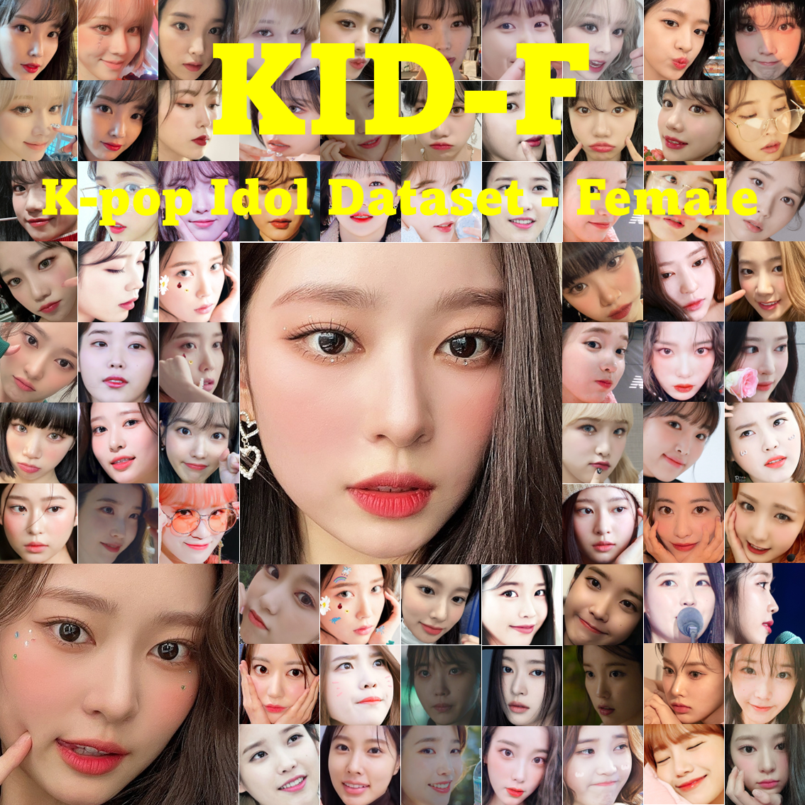

# KID-F
# **WARNING** - The dataset is not released yet. We will release soon.

Korean Idol Dataset - Female : High Quality Korean Female Idol Face Image Dataset with Identity Labels



# Description
**Korean Idol Dataset - Female (KID-F)** is the first dataset of Korean idol high quality face images. It consists of about **6,000 high quality face images** at **512x512** resolution and identity labels for each image.
We collected about 90,000 Korean female idol images and crop the face from each image. And we classified high quality face images. As a result, there are about 6,000 high quality face images in this dataset. 
There are 300 test datasets for a benchmark. There are no duplicate images between test and train images. Some identities in test images are not duplicated with train images. (It means some test images is new identity to the trained model) Each test images have its degraded pair. You can use these degraded test images for testing face super resolution performance. 
We also provide identity labels for each image. You can download the csv file from this repo.
You can use this dataset for training face super resolution models.

# Download
You can download dataset from here.
[Google Drive]()

# Agreement
- The use of this software is RESTRICTED to **non-commercial** research and educational purposes.
- All images of the KID-F dataset are obtained from the internet which are not property of EDA(PCEO-AI-CLUB). EDA is not responsible for the content nor the meaning of these images.
- You agree **not to** reproduce, duplicate, copy, sell, trade, resell or exploit for any commercial purposes, any portion of the images and any portion of derived data.
- You agree **not to** further copy, publish or distribute any portion of the KID-F dataset. Except, for internal use at a single site within the same organization it is allowed to make copies of the dataset.
- EDA reserves the right to terminate your access to the CelebA dataset at any time.

# Citation
```
@notyet{
  title = {},
  author = {Dongkyu Kim, Donggeon Han, Hyunwook Kwon, Dain Jeong, Cheol H. Jeong},
  month = {August},
  year = {2022}
}
```
